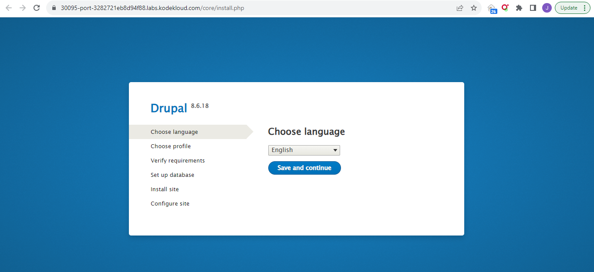

------------------------------

Start: &nbsp;&nbsp;&nbsp;&nbsp;&nbsp;&nbsp;&nbsp;&nbsp;2023-08-20 17:41:16  
Finished: &nbsp;&nbsp;2023-08-20 18:36:09

------------------------------

- [Requirements](#requirements)
- [Steps](#steps)
- [Resources](#resources)

------------------------------

# Lab 005: Deploy Drupal App on Kubernetes

## Requirements

We need to deploy a Drupal application on Kubernetes cluster. The Nautilus application development team want to setup a fresh Drupal as they will do the installation on their own. Below you can find the requirements, they have shared with us.

1) Configure a persistent volume **drupal-mysql-pv** with **hostPath = /drupal-mysql-data** (/drupal-mysql-data directory already exists on the worker Node i.e jump host), **5Gi** of storage and **ReadWriteOnce** access mode.

2) Configure one PersistentVolumeClaim named **drupal-mysql-pvc** with storage **request** of **3Gi** and **ReadWriteOnce** access mode.

3) Create a deployment **drupal-mysql** with **1 replica**, use **mysql:5.7** image. Mount the claimed PVC at **/var/lib/mysql**.

4) Create a deployment **drupal** with **1 replica** and use **drupal:8.6** image.

5) Create a NodePort type service which should be named as **drupal-service** and nodePort should be **30095**.

6) Create a service **drupal-mysql-service** to expose mysql deployment on port **3306**.

7) Set rest of the configuration for deployments, services, secrets etc as per your preferences. At the end you should be able to access the Drupal installation page by clicking on App button.


Note: The kubectl on jump_host has been configured to work with the kubernetes cluster.

------------------------------

## Steps

```bash
thor@jump_host ~$ ls -la /drupal-mysql-data/
total 8
drwxr-xr-x 2 thor thor 4096 Aug 20 09:59 .
drwxr-xr-x 1 root root 4096 Aug 20 09:59 .. 
```

Create the **pv-pvc.yml** as per requirements.

```yaml
--- 
apiVersion: v1
kind: PersistentVolume
metadata:
  name: drupal-mysql-pv
spec:
  capacity:
    storage: 5Gi
  accessModes:
    - ReadWriteOnce
  hostPath:
    path: /drupal-mysql-data
--- 
apiVersion: v1
kind: PersistentVolumeClaim
metadata:
  name: drupal-mysql-pvc
spec:
  accessModes:
    - ReadWriteOnce
  resources:
    requests:
      storage: 3Gi
```


Apply and verify. 

```bash
k apply -f .
```

```bash
thor@jump_host ~$ k get pv,pvc
NAME                               CAPACITY   ACCESS MODES   RECLAIM POLICY   STATUS      CLAIM   STORAGECLASS   REASON   AGE
persistentvolume/drupal-mysql-pv   5Gi        RWO            Retain           Available                                   35s

NAME                                     STATUS    VOLUME   CAPACITY   ACCESS MODES   STORAGECLASS   AGE
persistentvolumeclaim/drupal-mysql-pvc   Pending                                      standard       35s
```

Next, create **drupal.yml** for the deployments and services.

```yaml
#### MySQL 
---
apiVersion: apps/v1
kind: Deployment
metadata:
  name: drupal-mysql
spec:
  replicas: 1
  selector:
    matchLabels:
      app: drupal-mysql
  template:
    metadata:
      labels:
        app: drupal-mysql
    spec:
      containers:
        - name: mysql
          image: mysql:5.7
          env:
            - name: MYSQL_ROOT_PASSWORD
              value: your_password_here
          ports:
            - containerPort: 3306
          volumeMounts:
            - name: drupal-mysql-storage
              mountPath: /var/lib/mysql
      volumes:
        - name: drupal-mysql-storage
          persistentVolumeClaim:
            claimName: drupal-mysql-pvc
---
#### Drupal 
apiVersion: apps/v1
kind: Deployment
metadata:
  name: drupal
spec:
  replicas: 1
  selector:
    matchLabels:
      app: drupal
  template:
    metadata:
      labels:
        app: drupal
    spec:
      containers:
        - name: drupal
          image: drupal:8.6
          ports:
            - containerPort: 80
--- 
#### NodePort Service
apiVersion: v1
kind: Service
metadata:
  name: drupal-service
spec:
  type: NodePort
  ports:
    - port: 80
      targetPort: 80
      nodePort: 30095
  selector:
    app: drupal
--- 
#### MySQL service 
apiVersion: v1
kind: Service
metadata:
  name: drupal-mysql-service
spec:
  ports:
    - port: 3306
  selector:
    app: drupal-mysql
```

Apply and verify. 

```bash
k apply -f .
```
```bash
thor@jump_host ~$ k get po,deployments,svc,pv,pvc
NAME                               READY   STATUS    RESTARTS   AGE
pod/drupal-5b67849c6-txc9v         1/1     Running   0          92s
pod/drupal-mysql-c5d58677c-t56jv   1/1     Running   0          92s

NAME                           READY   UP-TO-DATE   AVAILABLE   AGE
deployment.apps/drupal         1/1     1            1           92s
deployment.apps/drupal-mysql   1/1     1            1           92s

NAME                           TYPE        CLUSTER-IP      EXTERNAL-IP   PORT(S)        AGE
service/drupal-mysql-service   ClusterIP   10.96.134.230   <none>        3306/TCP       92s
service/drupal-service         NodePort    10.96.171.58    <none>        80:30095/TCP   92s
service/kubernetes             ClusterIP   10.96.0.1       <none>        443/TCP        15m

NAME                                                        CAPACITY   ACCESS MODES   RECLAIM POLICY   STATUS      CLAIM                      STORAGECLASS   REASON   AGE
persistentvolume/drupal-mysql-pv                            5Gi        RWO            Retain           Available                                                      4m55s
persistentvolume/pvc-91d21630-fc03-4c1d-a861-dfc6ee9000a1   3Gi        RWO            Delete           Bound       default/drupal-mysql-pvc   standard                88s

NAME                                     STATUS   VOLUME                                     CAPACITY   ACCESS MODES   STORAGECLASS   AGE
persistentvolumeclaim/drupal-mysql-pvc   Bound    pvc-91d21630-fc03-4c1d-a861-dfc6ee9000a1   3Gi        RWO            standard       4m55s  
```

To verify, click the **App** at the upper right to open the application in a new tab.


Going over to the new tab:



------------------------------

## Resources